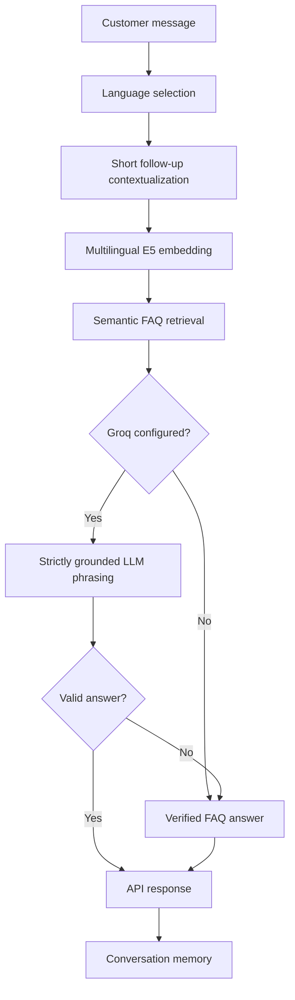

# Multilingual RAG Chatbot

A compact, production-minded reference API for a multilingual FAQ chatbot. It supports English and Urdu questions, semantic retrieval, short conversational follow-ups, optional strictly grounded LLM phrasing, and a safe verified-answer fallback when no LLM provider is configured.

This repository deliberately contains **generic example FAQ data only**. It does not contain customer data, credentials, product-specific documentation, or private PDFs.

## What it does

- Selects English or Urdu from the request or the message script.
- Converts short follow-up questions into contextual search queries using the immediately preceding customer message.
- Retrieves the nearest approved FAQ entry with the multilingual `intfloat/multilingual-e5-small` embedding model.
- Returns the verified answer directly by default.
- Optionally uses Groq to phrase the answer, with an instruction to use only the retrieved FAQ content.
- Falls back to the verified answer if the optional LLM is unavailable or returns an empty result.
- Stores conversation messages in memory for this example service.

## Architecture



## Repository layout

```text
.
├── app.py                 # FastAPI endpoints and in-memory conversation state
├── rag.py                 # FAQ loading, language selection, embeddings, retrieval
├── generator.py           # Optional grounded Groq generator and safe fallback
├── data/sample_faq.json   # Generic English/Urdu sample knowledge base
├── tests/test_rag.py      # Offline unit tests
├── .env.example           # Configuration template; no secrets
└── requirements.txt       # Python dependencies
```

## Prerequisites

- Python 3.9 or later
- Internet access on first use so Sentence Transformers can download the embedding model
- Optional: a Groq API key for LLM phrasing. The chatbot remains functional without it.

## Installation

```bash
git clone https://github.com/ahmadijaz1303/Multilingual-RAG-Chatbot.git
cd Multilingual-RAG-Chatbot
python -m venv .venv
```

Activate the virtual environment:

```bash
# Windows PowerShell
.venv\Scripts\Activate.ps1

# macOS / Linux
source .venv/bin/activate
```

Install dependencies and create local configuration:

```bash
python -m pip install -r requirements.txt
copy .env.example .env          # Windows
# cp .env.example .env          # macOS / Linux
```

Start the API:

```bash
python -m uvicorn app:app --host 127.0.0.1 --port 8000
```

Open the OpenAPI documentation at `http://127.0.0.1:8000/docs`.

## Configuration

Create `.env` locally from `.env.example`. Never commit a real `.env` file.

| Variable | Required | Purpose |
| --- | --- | --- |
| `EMBEDDING_MODEL` | No | Sentence Transformer model; defaults to `intfloat/multilingual-e5-small`. |
| `FAQ_DATA_PATH` | No | Path to a reviewed FAQ JSON file. |
| `GROQ_API_KEY` | No | Enables optional LLM phrasing. Keep server-side only. |
| `GROQ_MODEL` | No | Groq chat model used when the key is available. |

The first request can take longer because the embedding model may download and initialize. Production deployments should pre-cache the model in the server image or model cache.

## Knowledge-base format

`data/sample_faq.json` demonstrates the required fields:

```json
{
  "id": "account-access",
  "question_en": "How do I sign in?",
  "answer_en": "Use your registered email address to sign in.",
  "question_ur": "میں سائن اِن کیسے کروں؟",
  "answer_ur": "اپنے رجسٹرڈ ای میل ایڈریس سے سائن اِن کریں۔"
}
```

Replace the sample file with reviewed, version-controlled content appropriate for your own product. Answers should be factual, complete, and written in both supported languages.

## API usage

### Send a message

`POST /chat`

```bash
curl -X POST http://127.0.0.1:8000/chat \
  -H "Content-Type: application/json" \
  -d '{"message":"How do I sign in?","language":"english"}'
```

Example response:

```json
{
  "conversation_id": "a-server-generated-id",
  "message": "Use your registered email address to sign in.",
  "language": "english"
}
```

Pass the returned `conversation_id` in later requests to retain short conversational context. The original customer message remains unchanged in history; only the query supplied to retrieval is contextualized.

### Read a conversation

`GET /chat/{conversation_id}`

```bash
curl http://127.0.0.1:8000/chat/a-server-generated-id
```

## Grounding and provider behavior

The FAQ answer is the source of truth. When Groq is configured, `generator.py` asks the model to answer only from that answer. If the provider has an error or produces empty content, the API uses the approved FAQ answer instead. This avoids turning a temporary provider outage into a missing support response.

## Testing

Run the offline tests:

```bash
python -m pytest -q tests
```

The test suite does not make real provider calls and does not require a key.

## Production checklist

- Replace process-local memory with a database and link conversations to authenticated users.
- Add authorization so one user cannot retrieve another user's conversation.
- Add rate limiting, audit logs, monitoring, error tracking, and health checks.
- Keep API keys in secret management, never in a browser client or repository.
- Apply an answer-quality and human-handoff policy for unanswered or sensitive cases.
- Version and review FAQ data before each deployment.

## License

Choose and add a license appropriate for your intended use before distributing this code.
