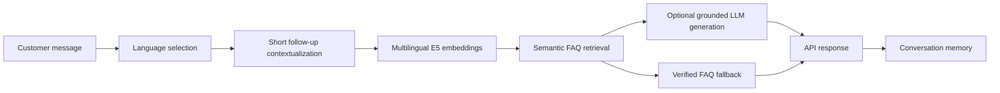

# Multilingual RAG Chatbot

A small, provider-neutral starting point for a multilingual FAQ chatbot. It uses local semantic retrieval with `intfloat/multilingual-e5-small`, supports English and Urdu queries, and preserves lightweight conversation context for short follow-up questions.

The repository includes only generic sample FAQ data. Replace `data/sample_faq.json` with your own reviewed knowledge base before production use.

## Architecture



## Setup

```bash
python -m venv .venv
# Activate the environment for your platform
python -m pip install -r requirements.txt
cp .env.example .env
python -m uvicorn app:app --host 127.0.0.1 --port 8000
```

The embedding model may download on first use. To avoid a runtime download, pre-provision it in the deployment image/cache.

If `GROQ_API_KEY` is configured, the optional Groq generator phrases answers using only the retrieved FAQ answer. If it is absent or unavailable, the API returns the verified FAQ answer directly.

## API

```bash
curl -X POST http://127.0.0.1:8000/chat \
  -H "Content-Type: application/json" \
  -d '{"message":"How do I sign in?","language":"english"}'
```

The API returns a conversation ID, grounded answer, and selected language. This example stores history in memory only; production systems should store conversations in a database with authentication and ownership checks.

## Production notes

- Keep retrieval/source metadata server-side; do not expose it to customers.
- Use reviewed, versioned FAQ content.
- Add authentication, persistence, rate limiting, monitoring, and human handoff rules before production deployment.
- Optional LLM generation must be strictly grounded in retrieved FAQ context and must never include API keys in client code.
